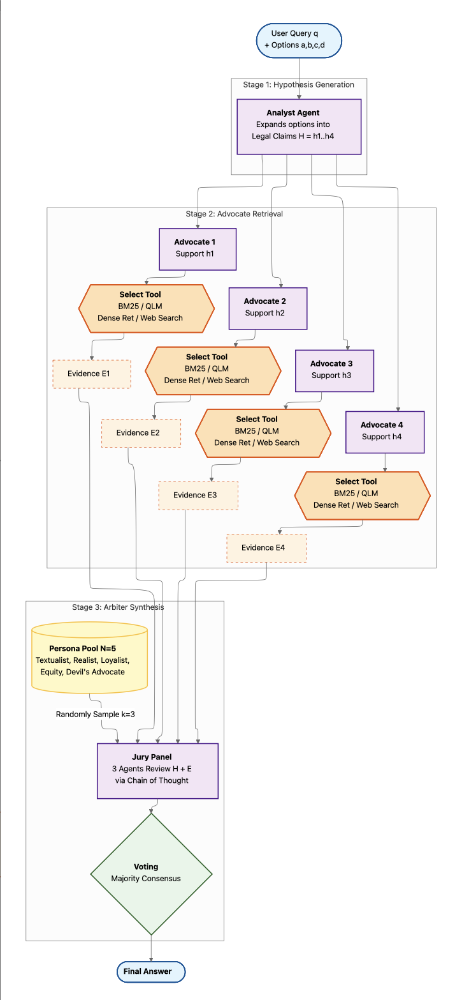

## Introduction

The following is CASE - Conflict Aware Synthesis of Evidence, a DSPy based multi-agent framework designed to simulate courtroom proceedings and take on an adversarial approach to finding the correct answer rooted in groudedness for the legal domain. 

## Approach

There are three main stages of CASE:

- Hypothesis Generation
- Advocate Retrieval
- Arbiter Synthesis

Hypothesis generation generates N hypothesis and passes it to the advocate agents. Each agent is given one hypothesis and the goal of the agent is to find the best evidence for its hypothesis using the tools at its disposal. BM25, QLM, dense vector search, and web search are the tools available for an advocate agent.

Once the advocate agent retrieves all the evidence for its hypothesis, all the retrieved evidence along with the hypothesis are provided to the arbiter synthesis. The arbiter synthesis chooses a jury of 3 from 5 legal personas. These agents then evaluate the evidence and vote on a hypothesis. In this manner, the answer is selected.

  

## About this Project

The dataset for this project was Bar Exam QA and the generative model of choice was Llama3:70B. Inferencing was carried out using OpenRouter.